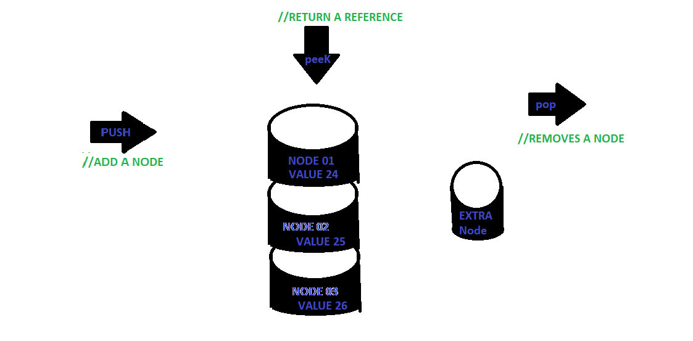
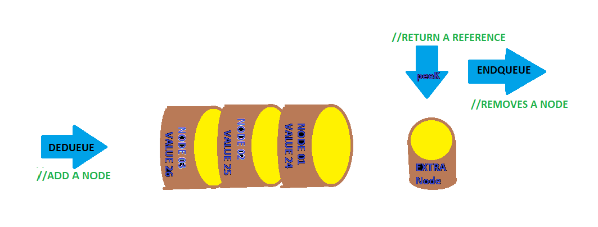

## Statcks And Queue
Stacks & Queues are Data Structures. In a stack Nodes which have values are 
implemented on top of each other. They hold values inside each other and can 
only be accessed from the top. Queue are similar to stacks however they are placed
on the side. 

## Author:
Tiger Hsu

## Version:
2.0.0 

## Overview
This is an impplemtation of a stack nodes and Q nodes in C#.

## Stack
This is an example of a stack: notice that its name is what it represents, nodes stacked on top of each other. In order to find Nodes you must pop off one Node at a time. In order to order to add nodes you can only add one at a time using pop. In order to see what is in a stack you can only peek at the top. An expression was given that stacks are like skinny grocery bags, you can't place something in the middle of the bag without going thru the top first.

## Queue
This is an example of a Queue. It is very similar to a stack. However the major difference is that the queue is a data structure that is leaning on its side. Another major difference is that adding the node list starts at the back of the queue. There is also different terms such as Dequeue returns and removes Node from the back.  Peek still looks at the front of the list. Enqueue is pulling from the top or in front of the list.

## Getting Started
- Fork this repo / or clone this repo
- Download Microsoft Visual Studio Community Edition 2017
- Open Visual Studio 2017
- Open this file name 
- Select run program.cs

## Architecture
This  Program uses C# and the .NET Core 2.0 platform

## Attribution
Parts of this code base is attributed to Kevin Farrow

## Resources
StackoverFlow
Microsoft Docs

## License
MIT License

## Change Log

04-07-2018 10:17am

